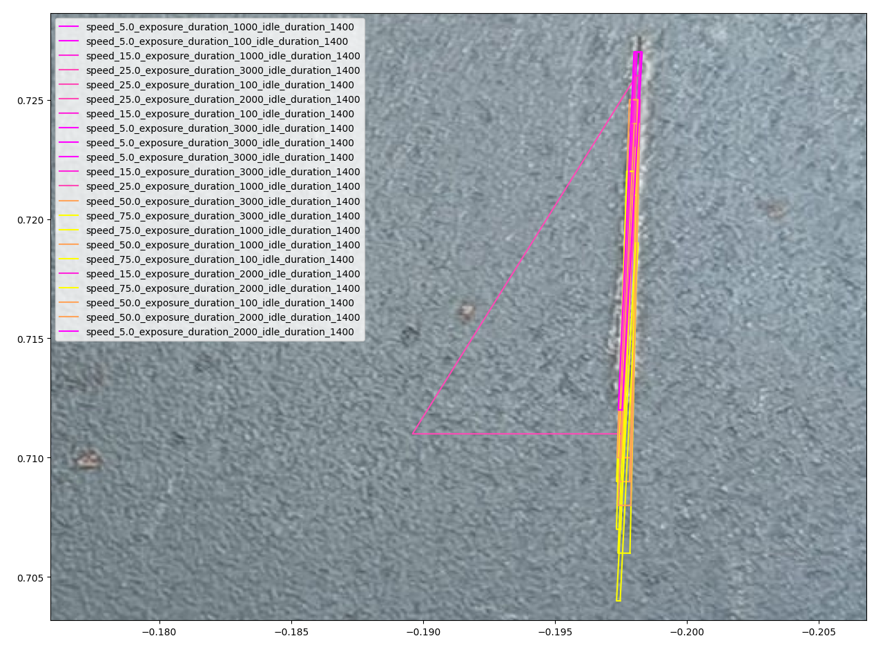

# Automated Inspection with Laser Line Scanner

## Table of Contents

1. [Introduction](#introduction)
1. [Definition of Defect](#definition-of-defect)
1. [Methodology](#methodology)
1. [Experiments Setup](#experiment-setup)
1. [Results](#results)

## Introduction

## Definition of Defect
This deliverable aims at detecting defects on two types of samples, metallic surfaces with potential imperfections and surfaces with two slits of fibre tape on them which will be referred to as edge detection. Each of these applications considers different things as defects:

1. __Metallic surface__: It is of utmost importance that the metallic slates do not have any manufacturing defects. The ones being searched for in this experiment are scratches __and defects:

1. __Edge detection__: The fibre tape has to be positioned in the right place with very little margin for error. The defects that may be found in this scenario are either overlaps or gaps between the two slits of fibre tape.

All these defects have different parameters that may be considered before categorising them as defects depending on the application:

1. __Scratch defects__: The driving dimension for this type of defect is the depth of the scratch. For the experiments that have been performed, a depth of 30 microns or deeper has been selected as the threshold to consider it as a defect. The reason behind this is that the rugosity of the surface creates small peaks and lows that are smaller than 30 microns.

1. __Waviness__: This kind of defect appears as peaks and valleys on the surface of the metal sheet. The driving dimensions are the amplitude and wavelength of said waves. The selected target is 20 microns for the amplitude and 40 for the wave length.

1. __Gap__: For the purpose of this experiment the trigger for the gap detection is the lowest possible. This means that theoretically it shall detect gaps that start at 12 microns width.

1. __Overlap__: An overlap will be considered to be so when the height of the fibre tape is twice the height of the fibre tape itself.

## Experiment Setup
The aim of this deliverable is to evaluate the performance and effectiveness of an automated inspect system with Laser Line Scanner (LLS). To conduct this investigation, we designed  a system that integrates Robot Manipulator Doosan M1013 with a mounted Laser Line Scanner (LLS) Micro-Epsilon LLT3010-25 as the robot's end-effector

### Doosan Robot M1013
Doosan Robot M1013 is a versatile, collaborate robot (cobot) that is designed to work alongside humans. This 6-axis robot has a payload of 10 kg, a reach of 1.3m, and repeatbility of 0.05mm. The key features of the Doosan Robot M1013 are:

- **Safety**: The robot is equipped with 6 high-end torque sensors that allow it to react immediately to subtle force changes (i.e, collisions). This ensures the safety of human operators working alongside the robot.
- **Force control**: The robot is capable of performing force-controlled tasks such as polishing and grinding. This is achived by the robot's ability to sense and react to subte force changes.
- **WorkCell Manager and ROS compatibility**: Users can work seamlessly even with complex applications on the Teach Pedant with intuative UI from Workcell Manager. On the other hand, the robot is also compatible with ROS for advanced programming, customization, and integration with other systems. 

### Micro-Epsilon LLT3010-25
The Micro-Epsilon LLT3010-25 is a high-precision profile LLS that uses a laser triangulation principle to meaure the profile of a surface. With a resolution of 2048 points per profile, a profile frequency of up to 10,000 Hz, and a linear precision of 1.5 µm, it is is widely used in industrial inspections task such as detecting surface defects, measuring precise dimensions, performing quality control, etc. Two critical parameters of the a LLS that influence the inspection performance are:

- **Exposure time**: The scanner performs a measure by emitting laser light and capturing the reflected light. The exposure time is the time duration for which the sensor capture the reflected light. A longer exposure time allows more light to reach the sensor, which is useful in low-light or low-reflecitity conditions. However, high exposure time might produce motion blur and noise if the the scanning object is moving or highly reflective.
- **Idle time**: After creating a measurment profile, the scanner needs to process the data before it can start a new measurement. The idle time is the time duration between two consecutive measurement. Longer idle time reduces the likelihood of data overlap and processing delay, yet, it reduces profile frequency and increaes the risk of missing profiles. 

###  Test Samples
We want to select our test samples to be as representative as posisble of the real-world application and running project at SAM XL. The three applications which are considered are Metal Surface Inspection, Automated Fiber Placement (AFP), and Thermoplast Residue Inspection.
    
- **Metal Surface Inspection**: We simulated a metal surface inspection scenario by using a metallic sheet with a series of scratches and waviness. These scratches have different width and depth which range from easy to detect to hard to detect. 

- **Automated Fiber Placement (AFP)**: We simulated three types of common defects in AFP process: gap, overlap, and fold. These defects are critical as they can lead to the failure of the composite part.

- **Thermoplast Residue Inspection**: We simulated a scenario where a thermoplast residue is left on the surface of a tool blocks. These residue needs to be detected and cleaned before the next production cycle to start.

## Methodology
To perform an inspection process, the inspection system executes a series of coordinated tasks. First, the settings for the Laser Line Scanner (LLS), including exposure time and idle time, are configured through a ROS client. Subsequently, the Doosan Robot is guided along waypoints at predefined velocities using a ROS driver. These waypoints also define the orientation of the robot, ensuring that the laser profiles remain within the optimal operating range and at the correct angle relative to the inspection surfaces.  As the robot moves along its path, profile data is transmitted over UDP and processed to identify defects in real-time. Finally, relevant data of the inspection process is recorded in a database for further analysis.   

Our data point contains robot velocities, LLS parameters (i.e, exposure time, idle time), defect locations, and defect characteristic (i.e, depth, starting point, end point) . A key challenge when collecting these data points is ensuring time synchronization. During the inspection, the robot state publisher and LLS ROS driver continuously stream their messages at different rates, thus each data entry must be synchronized to ensure that defect position can be mapped relative to robot’s base frame.  To achieve this, we use [message filter](http://wiki.ros.org/message_filters) to buffer incoming messages from both streams and match them based on temporal proximity. 

The overview architecture of this system is illustrated in the following figure:

Although both ROS and Doosan WorkCell Manager can be used as the interface to control Doosan Robot, we selected  ROS the primary interface for several reasons. First, it offers greater flexibility for programming and configuring our experiments, such as adjusting waypoints an robot velocity during runtime. Secondly, ROS provides the client an unified interface to define both robot and LLS parameters. Thirdly, ROS allows us to synchronized the communication between our system components, which is considerably beneficial when we need to collect our data in a synchronized manner (i.e., localize defect during inspecting).

## Results

### Precision/Recall/F1-Score

 

### Intersection over Union (IoU)

